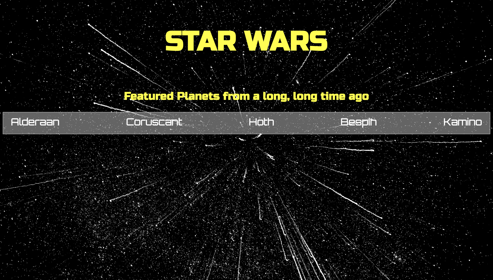

# Trip to the Planets of Star Wars

## A UI webpage using the SWAPI (Star Wars API) for data.

-----------------------------
This webpage features five diverse planets featured in the Star Wars film saga, and allows users to experience the look of the planet as well as unique planerary facts, coutesy of the SWAPI!

---------------------------------

#### Languages Used
- HTML
- CSS
- Javascript
----------------------------------

#### Design

-------------------------------------

#### Things to Work On
I will continue to work minimizing the delayed response the webpage has by editing my Javascript, and finding a way to loop all options in one, rather than creating five different event listeners. In addition, I will make the page more responsive, and add more dimensions to the page: such as a drop down menu with featured planets, species, people, etc.